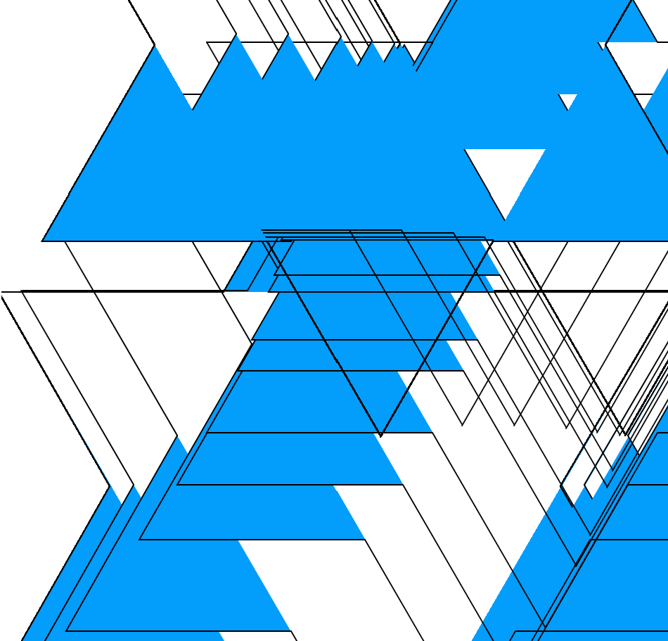
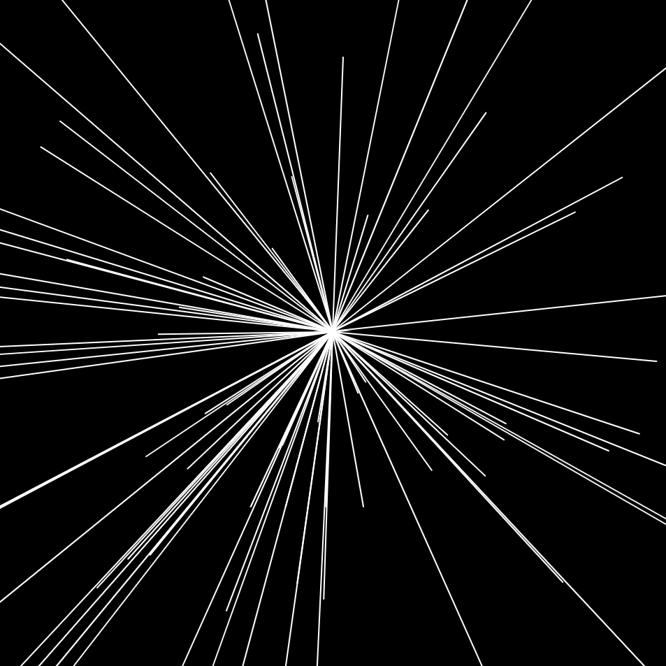

## 🎨 Sketches with p5.js

Simple generative sketches built with **[p5.js](https://p5js.org/)** that draw evolving regular polygons based on mouse position and trigonometric transformations.

---

### How to Run
1. Clone or download this repository  
2. Start a **local server** in the project folder using VS Code Live Server extension
3. Open your browser and go to:

   ```
   http://localhost:5500
   ```
4. Move your mouse over the canvas to explore the effect 

### Built With
[](https://p5js.org/) - Creative coding library for JavaScript  

& [Dessins géométriques et artistiques avec votre micro-ordinateur](https://editor.p5js.org/v3ga/collections/ALPCSgG3E) by v3ga

---

### Demo screenshots

### `stars/sketch.js`



### `lines/sketch.js`


